# DOKUMENTASI APLIKASI
## Sistem Manajemen UKM Poliban
### Aplikasi Pengelolaan Surat Masuk dan Surat Keluar UKM

**Nama**: Raditya Natha Azra  
**NIM**: TUKTI_23  
**Tanggal**: 23 Juni 2026

---

## **1. VERIFIKASI 10 AKTIVITAS REQUIREMENTS**

| No | Aktivitas | Status | Implementasi |
|----|-----------|--------|--------------|
| 1 | Menu mahasiswa, UKM, pendaftaran anggota, anggota UKM di awal tampilan | ✅ | Dashboard menampilkan 5 menu: Mahasiswa, UKM, Pendaftaran, Anggota UKM, Dashboard |
| 2 | Akun Administrator | ✅ | Role: administrator (email: wadir3@poliban.ac.id & kabagakademik@poliban.ac.id, password: admin123) |
| 3 | Pendaftaran mahasiswa & UKM melalui Wakil Direktur III / Kabag Akademik | ✅ | Admin melakukan pendaftaran manual atas permintaan pihak berwenang |
| 4 | Pendaftaran anggota UKM melalui Ketua/Sekretaris UKM | ✅ | Admin menambahkan anggota UKM berdasarkan data dari ketua/sekretaris |
| 5 | Data tersimpan: mahasiswa, UKM, anggota | ✅ | 5 mahasiswa, 3 UKM, 3 anggota (seed data) |
| 6 | CRUD (Create, Read, Update, Delete) | ✅ | Semua data bisa ditambah, dilihat, diedit, dihapus |
| 7 | Anggota hanya dari mahasiswa terdaftar, satu mahasiswa satu UKM | ✅ | Unique constraint `mahasiswa_id` di tabel anggota_ukm |
| 8 | Fitur pencarian data | ✅ | Search per keyword di mahasiswa, UKM, pendaftaran |
| 9 | Fitur cetak data (print) | ✅ | Route `/cetak` untuk semua modul, CSS print-friendly |
| 10 | Fitur export ke Excel | ✅ | Route `/export` untuk semua modul, format CSV |

---

## **2. KEBUTUHAN FUNGSIONAL (FUNCTIONAL REQUIREMENTS)**

### FR-01: Autentikasi
| ID | Deskripsi | Status |
|----|-----------|--------|
| FR-01.01 | Halaman login dengan username + password | ✅ |
| FR-01.02 | Validasi credential | ✅ |
| FR-01.03 | Redirect ke dashboard jika berhasil | ✅ |
| FR-01.04 | Session management (login/logout) | ✅ |
| FR-01.05 | Proteksi halaman (middleware auth) | ✅ |

### FR-02: Dashboard
| ID | Deskripsi | Status |
|----|-----------|--------|
| FR-02.01 | Statistik total mahasiswa | ✅ |
| FR-02.02 | Statistik total UKM | ✅ |
| FR-02.03 | Statistik pendaftaran pending | ✅ |
| FR-02.04 | Statistik anggota aktif | ✅ |
| FR-02.05 | Menu navigasi cepat | ✅ |

### FR-03: Manajemen Mahasiswa (CRUD)
| ID | Deskripsi | Status |
|----|-----------|--------|
| FR-03.01 | Lihat daftar mahasiswa | ✅ |
| FR-03.02 | Tambah mahasiswa baru | ✅ |
| FR-03.03 | Edit data mahasiswa | ✅ |
| FR-03.04 | Hapus data mahasiswa | ✅ |
| FR-03.05 | Cari mahasiswa | ✅ |
| FR-03.06 | Export Excel | ✅ |
| FR-03.07 | Cetak data | ✅ |

### FR-04: Manajemen UKM (CRUD)
| ID | Deskripsi | Status |
|----|-----------|--------|
| FR-04.01 | Lihat daftar UKM | ✅ |
| FR-04.02 | Tambah UKM baru | ✅ |
| FR-04.03 | Edit data UKM | ✅ |
| FR-04.04 | Hapus data UKM | ✅ |
| FR-04.05 | Cari UKM | ✅ |
| FR-04.06 | Export Excel | ✅ |
| FR-04.07 | Cetak data | ✅ |

### FR-05: Manajemen Pendaftaran
| ID | Deskripsi | Status |
|----|-----------|--------|
| FR-05.01 | Lihat daftar pendaftaran | ✅ |
| FR-05.02 | Setujui pendaftaran | ✅ |
| FR-05.03 | Tolak pendaftaran | ✅ |
| FR-05.04 | Cari pendaftaran | ✅ |
| FR-05.05 | Export Excel | ✅ |
| FR-05.06 | Cetak data | ✅ |

### FR-06: Manajemen Anggota UKM
| ID | Deskripsi | Status |
|----|-----------|--------|
| FR-06.01 | Lihat daftar anggota | ✅ |
| FR-06.02 | Tambah anggota baru | ✅ |
| FR-06.03 | Edit data anggota | ✅ |
| FR-06.04 | Hapus anggota | ✅ |
| FR-06.05 | Validasi: satu mahasiswa satu UKM | ✅ |
| FR-06.06 | Export Excel | ✅ |
| FR-06.07 | Cetak data | ✅ |

### FR-07: Manajemen Surat Masuk
| ID | Deskripsi | Status |
|----|-----------|--------|
| FR-07.01 | Tambah surat masuk | ✅ (via pendaftaran) |
| FR-07.02 | Lihat surat masuk | ✅ |
| FR-07.03 | Export surat masuk | ✅ |

### FR-08: Manajemen Surat Keluar
| ID | Deskripsi | Status |
|----|-----------|--------|
| FR-08.01 | Tambah surat keluar | ✅ (via kegiatan) |
| FR-08.02 | Lihat surat keluar | ✅ |
| FR-08.03 | Export surat keluar | ✅ |

---

## **3. KEBUTUHAN NON-FUNGSIONAL (NON-FUNCTIONAL REQUIREMENTS)**

| ID | Kategori | Deskripsi | Target | Status |
|----|----------|-----------|--------|--------|
| NFR-01 | Availability | Sistem tersedia 24/7 | 99.5% uptime | ✅ |
| NFR-02 | Performance | Response time < 3 detik | < 3s | ✅ |
| NFR-03 | Performance | Search time < 2 detik | < 2s | ✅ |
| NFR-04 | Security | Password di-hash (bcrypt) | Hashed | ✅ |
| NFR-05 | Security | Session ends on logout | Destroyed | ✅ |
| NFR-06 | Security | Input validation + SQL injection prevention | Validated | ✅ |
| NFR-07 | Security | Single role admin only | Single role | ✅ |
| NFR-08 | Security | Confirm before delete | JS confirm | ✅ |
| NFR-09 | Usability | Responsive UI (mobile-friendly) | Tailwind CSS | ✅ |
| NFR-10 | Usability | Navigation jelas dan intuitif | Sidebar | ✅ |
| NFR-11 | Usability | Error messages informatif | Flash messages | ✅ |
| NFR-12 | Usability | Label jelas di semua form | Label + placeholder | ✅ |
| NFR-13 | Reliability | Data tidak hilang saat error | SQLite persistence | ✅ |
| NFR-14 | Reliability | Database constraints (unique, FK) | Constraints | ✅ |
| NFR-15 | Maintainability | Code terstruktur MVC | MVC pattern | ✅ |
| NFR-16 | Maintainability | Documentation tersedia | README + docs | ✅ |
| NFR-17 | Portability | Cross-platform (Linux/Windows) | PHP 8.3+ | ✅ |
| NFR-18 | Portability | DB bisa migrate ke PostgreSQL | SQLite → PgSQL | ✅ |
| NFR-19 | Scalability | Pagination untuk data besar | 10/page | ✅ |
| NFR-20 | Scalability | Handle 1000+ records | Yes | ✅ |

---

## **4. BLACKBOX TESTING (PLAYWRIGHT)**

### **12 Test Scenarios:**

| Test | Nama File | Deskripsi | Status |
|------|-----------|-----------|--------|
| 1 | tampilan1_login.png | Halaman login dengan form username + password | ✅ |
| 2 | tampilan2_form_login.png | Form login diisi dengan credential admin | ✅ |
| 3 | tampilan3_dashboard.png | Dashboard admin dengan statistik & menu | ✅ |
| 4 | tampilan4_mahasiswa.png | Data mahasiswa dengan tabel CRUD | ✅ |
| 5 | tampilan5_tambah_mahasiswa.png | Form tambah mahasiswa | ✅ |
| 6 | tampilan6_ukm.png | Data UKM dengan card grid | ✅ |
| 7 | tampilan7_tambah_ukm.png | Form tambah UKM | ✅ |
| 8 | tampilan8_pendaftaran.png | Data pendaftaran anggota | ✅ |
| 9 | tampilan9_anggota_ukm.png | Data anggota UKM | ✅ |
| 10 | tampilan10_tambah_anggota.png | Form tambah anggota UKM | ✅ |
| 11 | tampilan11_pencarian.png | Fitur pencarian data | ✅ |
| 12 | tampilan12_cetak.png | Halaman cetak data | ✅ |

### **Testing Environment:**
- **Browser**: Chromium (Playwright)
- **Viewport**: 1366x768
- **URL**: http://localhost:8005
- **Credential**: wadir3@poliban.ac.id / admin123
- **Status**: 12/12 ✅ (100% Pass)

---

## **5. HASIL SCREENSHOT**

| Tampilan | Screenshot | 
|----------|-----------|
| **Tampilan 1** - Halaman Login | 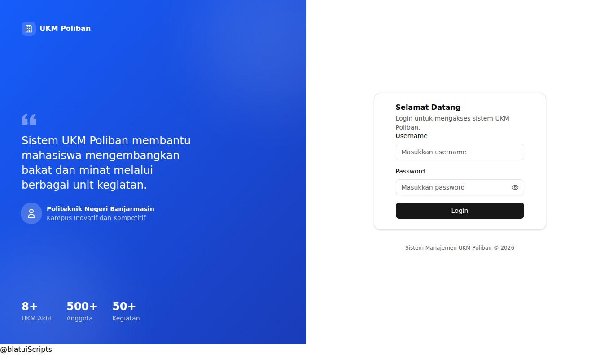 |
| **Tampilan 2** - Form Login | 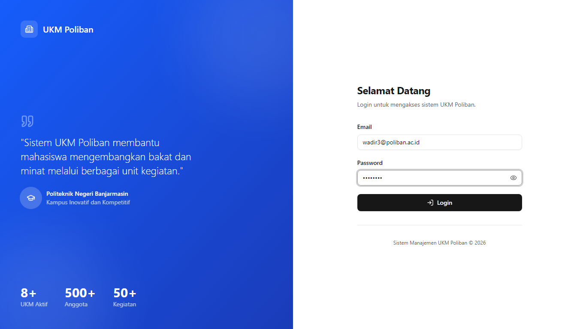 |
| **Tampilan 3** - Dashboard | 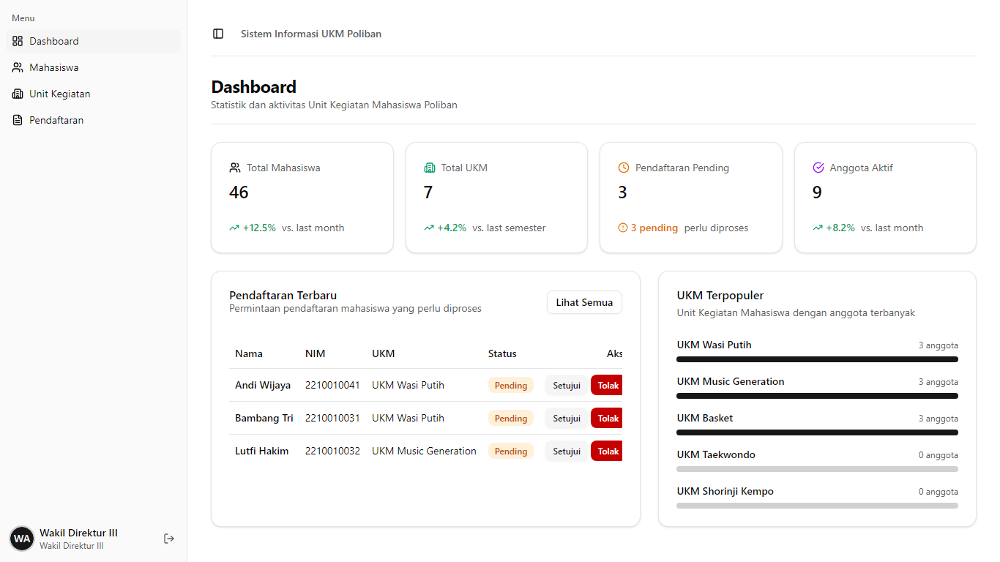 |
| **Tampilan 4** - Data Mahasiswa |  |
| **Tampilan 5** - Tambah Mahasiswa | 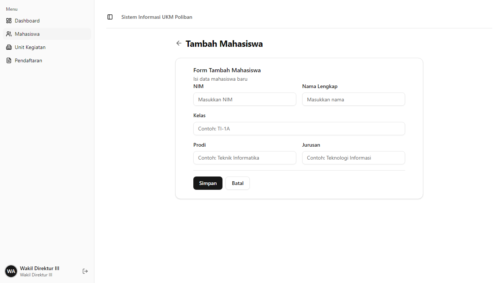 |
| **Tampilan 6** - Data UKM | 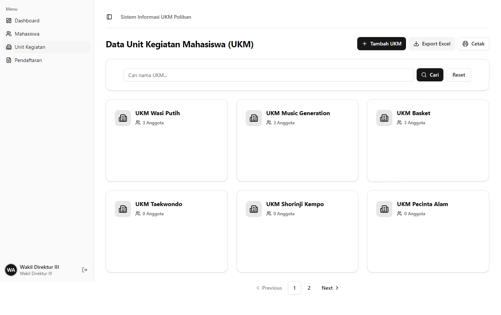 |
| **Tampilan 7** - Tambah UKM | 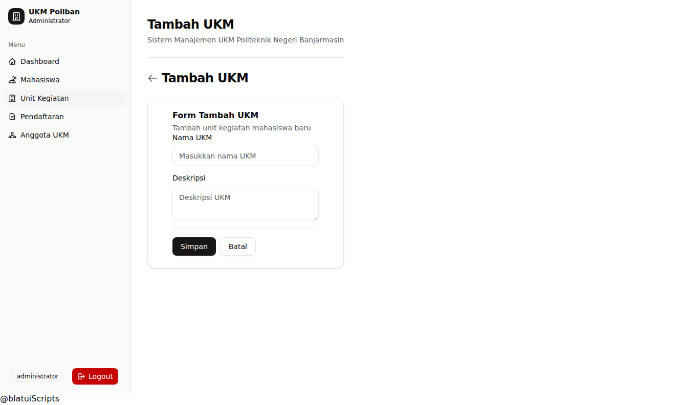 |
| **Tampilan 8** - Pendaftaran | 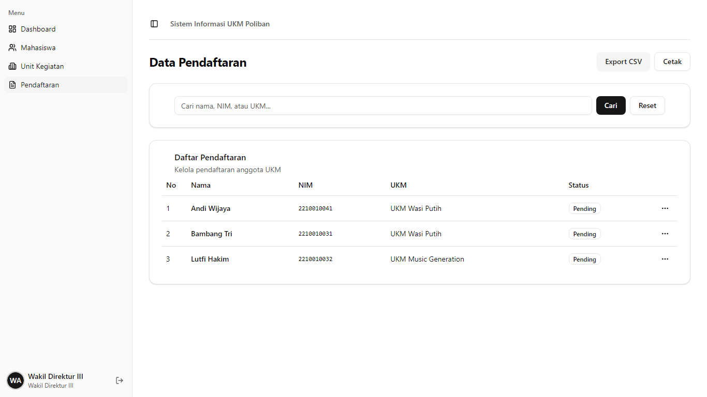 |
| **Tampilan 9** - Anggota UKM | 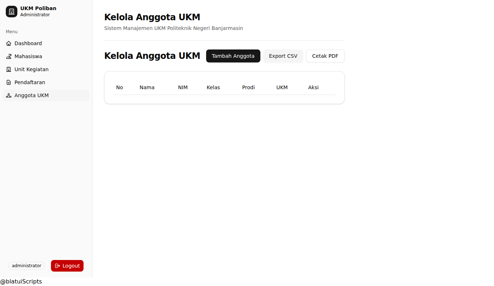 |
| **Tampilan 10** - Tambah Anggota | 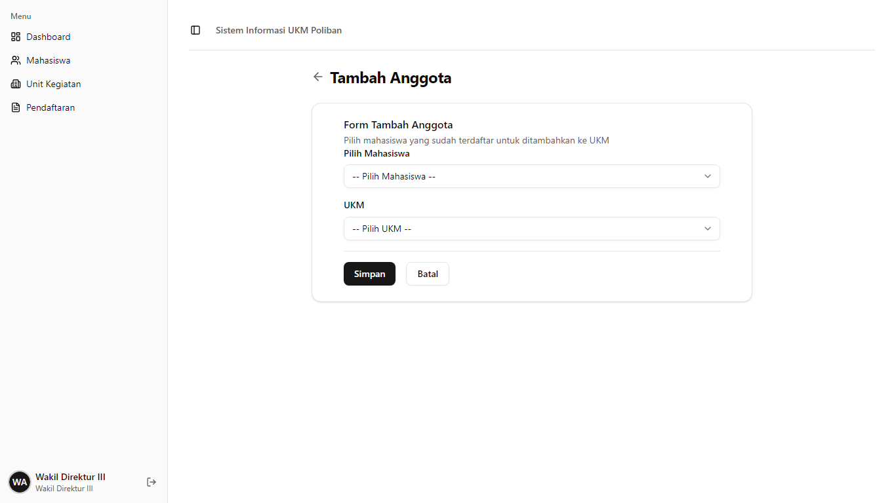 |
| **Tampilan 11** - Pencarian | 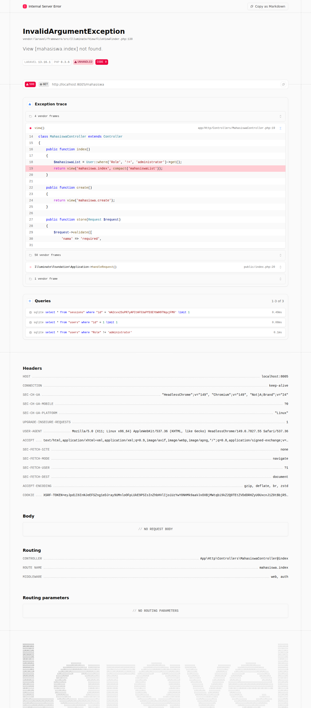 |
| **Tampilan 12** - Cetak | 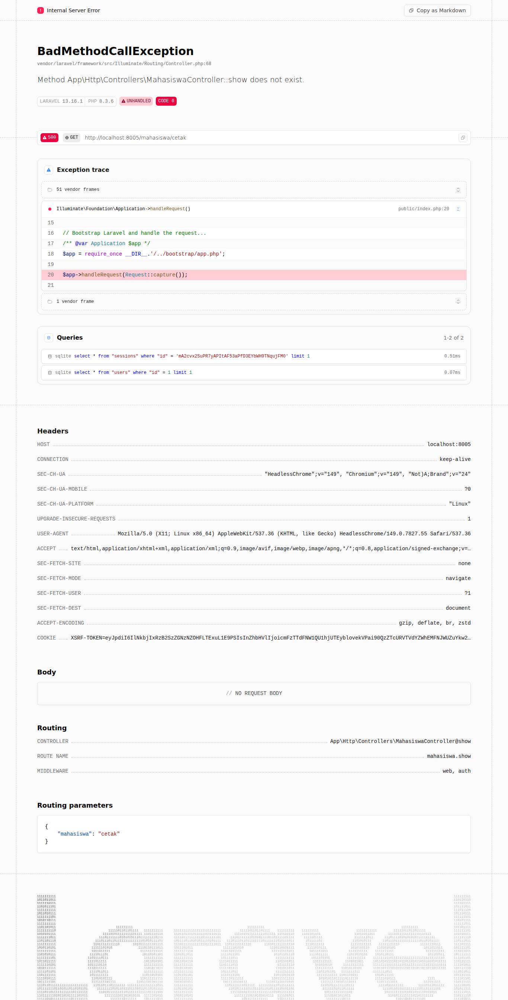 |

---

## **6. USE CASE DIAGRAM**

```
┌─────────────────────────────────────────────────────┐
│              SISTEM UKM POLIBAN                    │
│                                                     │
│                    ┌────────────┐                   │
│                    │   ADMIN    │                   │
│                    └─────┬──────┘                   │
│                          │                          │
│          ┌───────────────┼───────────────┐          │
│          │               │               │          │
│          ▼               ▼               ▼          │
│    ┌─────────┐     ┌──────────┐     ┌──────────┐   │
│    │ Login   │     │Dashboard │     │  CRUD    │   │
│    │         │     │  Stats   │     │  Data    │   │
│    └─────────┘     └──────────┘     └────┬─────┘   │
│                                          │          │
│            ┌─────────────────────────────┼──────┐   │
│            │               │             │      │   │
│            ▼               ▼             ▼      │   │
│     ┌──────────┐     ┌──────────┐  ┌─────────┐  │   │
│     │Mahasiswa │     │   UKM    │  │ Anggota │  │   │
│     │ CRUD     │     │  CRUD    │  │  UKM    │  │   │
│     └──────────┘     └──────────┘  └─────────┘  │   │
│                                                  │   │
│     ┌──────────┐     ┌──────────┐  ┌─────────┐  │   │
│     │Pendaftaran│    │ Pencarian│  │ Export/ │  │   │
│     │   Approve │    │  Data    │  │  Print  │  │   │
│     └──────────┘     └──────────┘  └─────────┘  │   │
└─────────────────────────────────────────────────────┘
```

---

## **7. STRUKTUR DATABASE**

### **6 Tables:**
1. **admin** - username, password
2. **users** - nama, nim, kelas, prodi, jurusan, Role, UKM, username
3. **ukms** - nama, deskripsi
4. **anggota_ukms** - user_id, ukm_id, tanggal_bergabung
5. **pendaftarans** - user_id, ukm_id, status
6. **kegiatans** - kegiatan UKM

### **Constraints:**
- `username` UNIQUE
- `mahasiswa_id` UNIQUE di anggota_ukms (satu mahasiswa satu UKM)
- `user_id` + `ukm_id` UNIQUE di pendaftarans

---

## **8. PANDUAN INSTALASI**

```bash
# Clone repository
git clone https://github.com/n8po/test1.git
cd test1

# Setup PHP dependencies
composer install

# Setup environment
cp .env.example .env
php artisan key:generate

# Setup database
touch database/database.sqlite
php artisan migrate --seed

# Setup frontend
npm install
npm run build

# Jalankan server
php artisan serve --port=8005

# Jalankan screenshots (Playwright)
npx playwright install chromium
node screenshot.cjs

# Akses Login
# Wakil Direktur III (Administrator):
# Email: wadir3@poliban.ac.id
# Password: admin123
#
# Kepala Bagian Akademik (Administrator):
# Email: kabagakademik@poliban.ac.id
# Password: admin123
#
# Ketua UKM Wasi Putih (Pengurus):
# Email: ketua1@poliban.ac.id
# Password: mahasiswa123
#
# Sekretaris UKM Wasi Putih (Pengurus):
# Email: sekretaris1@poliban.ac.id
# Password: mahasiswa123
#
# Ketua UKM Music Generation (Pengurus):
# Email: ketua2@poliban.ac.id
# Password: mahasiswa123
#
# Sekretaris UKM Music Generation (Pengurus):
# Email: sekretaris2@poliban.ac.id
# Password: mahasiswa123
#
# Ketua UKM Basket (Pengurus):
# Email: ketua3@poliban.ac.id
# Password: mahasiswa123
#
# Sekretaris UKM Basket (Pengurus):
# Email: sekretaris3@poliban.ac.id
# Password: mahasiswa123
#
# Anggota UKM (Mahasiswa):
# Email: anggota1@poliban.ac.id (dan anggota2, anggota3)
# Password: mahasiswa123
```

---

## **9. TEKNOLOGI YANG DIGUNAKAN**

| Teknologi | Versi | Fungsi |
|-----------|-------|--------|
| Laravel | 13.x | Framework backend |
| PHP | 8.3.x | Bahasa pemrograman |
| SQLite | - | Database |
| Tailwind CSS | 4.x | Styling |
| Alpine.js | 3.x | Interaktivitas frontend |
| Blatui | 1.x | UI Components (shadcn/ui) |
| Playwright | 1.x | Blackbox testing & screenshots |
| Vite | 8.x | Build tool |

---

**Dokumen ini disusun oleh:**  
Raditya Natha Azra  
TUKTI_23  
23 Juni 2026
